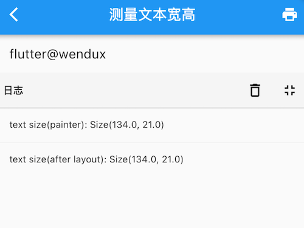
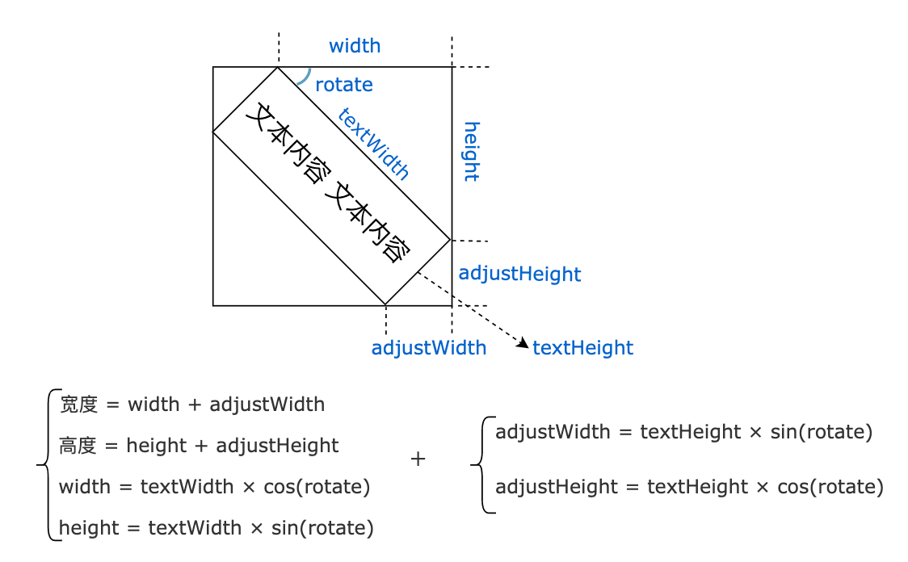
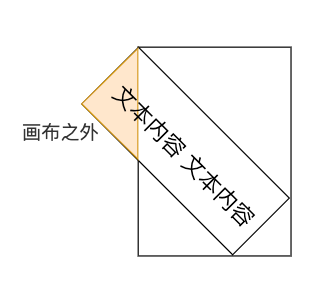
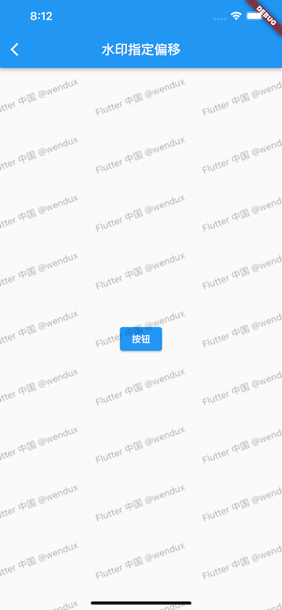

# 10.8 水印实例: 文本绘制与离屏渲染

本节将通过实现一个水印组件来介绍一下如何绘制文本以及如何进行离屏渲染。

在实际场景中，大多数情况下水印是要铺满整个屏幕的，如果不需要铺满屏幕，通常直接用组件组合即可实现，本节我们主要讨论的是需要铺满屏幕的水印。

##  10.8.1 水印组件WaterMark

我们可以通过绘制一个“单元水印”，然后让它在整个水印组件的背景中重复即可实现我们期望的功能，因此我们可以直接使用 DecoratedBox ，它拥有背景图重复功能。重复的问题解决后，那么主要的问题便是如何绘制单元水印，为了灵活好扩展，我们定义一个水印画笔接口，这样一来我们可以预置一些常用的画笔实现来满足大多数场景，同时如果开发者有自定义需求的话也可以通过自定义画笔来实现。

下面是水印组件 WaterMark 的定义：

```dart
class WaterMark extends StatefulWidget {
  WaterMark({
    Key? key,
    this.repeat = ImageRepeat.repeat,
    required this.painter,
  }) : super(key: key);

  /// 单元水印画笔
  final WaterMarkPainter painter;

  /// 单元水印的重复方式
  final ImageRepeat repeat;

  @override
  State<WaterMark> createState() => _WaterMarkState();
}
```

下面看一下 State 实现：

```dart
class _WaterMarkState extends State<WaterMark> {
  late Future<MemoryImage> _memoryImageFuture;

  @override
  void initState() {
    // 缓存的是promise
    _memoryImageFuture = _getWaterMarkImage();
    super.initState();
  }

  @override
  Widget build(BuildContext context) {
    return SizedBox.expand( // 水印尽可能大
      child: FutureBuilder(
        future: _memoryImageFuture,
        builder: (BuildContext context, AsyncSnapshot snapshot) {
          if (snapshot.connectionState != ConnectionState.done) {
            // 如果单元水印还没有绘制好先返回一个空的Container
            return Container(); 
          } else {
            // 如果单元水印已经绘制好，则渲染水印
            return DecoratedBox(
              decoration: BoxDecoration(
                image: DecorationImage(
                  image: snapshot.data, // 背景图，即我们绘制的单元水印图片
                  repeat: widget.repeat, // 指定重复方式
                  alignment: Alignment.topLeft,
                ),
              ),
            );
          }
        },
      ),
    );
  }

  @override
  void didUpdateWidget(WaterMark oldWidget) {
   ... //待实现
  }

  // 离屏绘制单元水印并将绘制结果转为图片缓存起来
  Future<MemoryImage> _getWaterMarkImage() async {
    ... //待实现
  }

  @override
  void dispose() {
   ...// 待实现
  }
}
```

我们通过 DecoratedBox 来实现背景图重复，同时我们在组件初始化时开始进行离屏绘制单元水印，并将结果缓存在 MemoryImage 中，因为离屏绘制是一个异步任务，所以直接缓存 Future 即可。这里需要注意，当组件重新build时，如果画笔配置发生变化，则我们需要重新绘制单元水印并缓存新的绘制结果：

```dart
  @override
  void didUpdateWidget(WaterMark oldWidget) {
     // 如果画笔发生了变化（类型或者配置）则重新绘制水印
    if (widget.painter.runtimeType != oldWidget.painter.runtimeType ||
        widget.painter.shouldRepaint(oldWidget.painter)) {
      //先释放之前的缓存
      _memoryImageFuture.then((value) => value.evict());
      //重新绘制并缓存
      _memoryImageFuture = _getWaterMarkImage();
    }
    super.didUpdateWidget(oldWidget);  
  }
```

注意，在重新绘制单元水印之前要先将旧单元水印的缓存清理掉，清理缓存可以通过调用 MemoryImage 的 evict 方法。同时，当组件卸载时，我们也要释放缓存：

```dart
  @override
  void dispose() {
    //释放图片缓存
    _memoryImageFuture.then((value) => value.evict());
    super.dispose();
  }
```

接下来就需要重新绘制单元水印了，调用 `_getWaterMarkImage() ` 方法即可，该方法的功能是离屏绘制单元水印并将绘制结果转为图片缓存起来，下面我们看一下它的实现。

### 离屏绘制

离屏绘制的代码如下：

```dart
// 离屏绘制单元水印并将绘制结果保存为图片缓存起来
Future<MemoryImage> _getWaterMarkImage() async {
  // 创建一个 Canvas 进行离屏绘制，细节和原理请查看本书后面关于Flutter绘制原理相关章节
  final recorder = ui.PictureRecorder();
  final canvas = Canvas(recorder);
  // 绘制单元水印并获取其大小
  final Size size = widget.painter.paintUnit(canvas);
  final picture = recorder.endRecording();
  //将单元水印导为图片并缓存起来
  final img = await picture.toImage(size.width.ceil(), size.height.ceil());
  final byteData = await img.toByteData(format: ui.ImageByteFormat.png);
  final pngBytes = byteData!.buffer.asUint8List();
  return MemoryImage(pngBytes);
}
```

我们通过手动创建了一个 Canvas 和一个 PictureRecorder 来实现离屏绘制，PictureRecorder  的功能先简单介绍一下，我们会在本书后面绘制原理相关章节详细介绍，简单来说：调用 Canvas API 后，实际上产生的是一系列绘制指令，这些绘制指令执行后才能获取绘制结果，而PictureRecorder 就是一个绘制指令记录器，它可以记录一段时间内所有绘制指令，我们可以通过调用 `recorder.endRecording()`  方法来获取记录的绘制指令，该方法返回一个 Picture 对象，它是绘制指令的载体，它有一个 toImage 方法，调用后会执行绘制指令获得绘制的像素结果（ui.Image 对象），之后我们就可以将像素结果转为 png 格式的数据并缓存在MemoryImage 中。

## 10.8.2 单元水印画笔

现在我们看一下如何绘制单元水印，我们先看一下水印画笔接口的定义：

```dart
/// 定义水印画笔
abstract class WaterMarkPainter {
  /// 绘制"单元水印"，完整的水印是由单元水印重复平铺组成,返回值为"单元水印"占用空间的大小。
  /// [devicePixelRatio]: 因为最终要将绘制内容保存为图片，所以在绘制时需要根据屏幕的
  /// DPR来放大，以防止失真
  Size paintUnit(Canvas canvas, double devicePixelRatio);

  /// 是否需要重绘
  bool shouldRepaint(covariant WaterMarkPainter oldPainter) => true;
}
```

定义很简单，就两个函数：

- paintUnit 用于绘制单元水印，这里需要注意一点，因为很多 UI 元素的大小只能在绘制时获取，无法提前知道大小，所以 `paintUnit` 在完成绘制单元水印任务的同时，最后得返回单元水印的大小信息，它在导为图片时要用到。
- shouldRepaint：当画笔状态发生变化且会影响单元水印的外观时返回 true，否则返回 false，返回 true 后重绘单元水印。它是在 _WaterMarkState 的 didUpdateWidget 方法中调用，读者可以结合源码理解。

## 10.8.3 文本水印画笔

下面我们实现一个文本水印画笔，它可以绘制一段文本，我们可以指定文本的样式和旋转角度。

```dart
/// 文本水印画笔
class TextWaterMarkPainter extends WaterMarkPainter {
  TextWaterMarkPainter({
    Key? key,
    double? rotate,
    EdgeInsets? padding,
    TextStyle? textStyle,
    required this.text,
  })  : assert(rotate == null || rotate >= -90 && rotate <= 90),
        rotate = rotate ?? 0,
        padding = padding ?? const EdgeInsets.all(10.0),
        textStyle = textStyle ??
            TextStyle(
              color: Color.fromARGB(20, 0, 0, 0),
              fontSize: 14,
            );

  double rotate; // 文本旋转的度数，是角度不是弧度
  TextStyle textStyle; // 文本样式
  EdgeInsets padding; // 文本的 padding
  String text; // 文本

  @override
  Size paintUnit(Canvas canvas,double devicePixelRatio) {
   // 1. 先绘制文本
   // 2. 应用旋转和padding 
  }

  @override
  bool shouldRepaint(TextWaterMarkPainter oldPainter) {
   ...// 待实现
  }
}
```

paintUnit 的绘制分两步：

1. 绘制文本
2. 应用旋转和padding

### 绘制文本

文本的绘制三步：

1. 创建一个 ParagraphBuilder，记为 builder。
2. 调用 builder.add 添加要绘制的字符串。
3. 构建文本并进行 layout，因为在 layout 后才能知道文本所占用的空间。
4. 调用 canvas.drawParagraph 绘制。

具体代码如下：

```dart
import 'dart:ui' as ui;
...
 @override
  Size paintUnit(Canvas canvas,double devicePixelRatio) {
    //根据屏幕 devicePixelRatio 对文本样式中长度相关的一些值乘以devicePixelRatio
    final _textStyle = _handleTextStyle(textStyle, devicePixelRatio);
    final _padding = padding * devicePixelRatio;
  
    //构建文本段落
    final builder = ui.ParagraphBuilder(_textStyle.getParagraphStyle(
      textDirection: textDirection,
      textAlign: TextAlign.start,
      textScaleFactor: devicePixelRatio,
    ));

    //添加要绘制的文本及样式
    builder
      ..pushStyle(_textStyle.getTextStyle()) // textStyle 为 ui.TextStyle
      ..addText(text);

    //layout 后我们才能知道文本占用的空间
    ui.Paragraph paragraph = builder.build()
      ..layout(ui.ParagraphConstraints(width: double.infinity));

    //文本占用的真实宽度
    final textWidth = paragraph.longestLine.ceilToDouble();
    //文本占用的真实高度
    final fontSize = paragraph.height;
    
    ...//省略应用旋转和 padding 的相关代码

    //绘制文本
    canvas.drawParagraph(paragraph, Offset.zero);

  }

  TextStyle _handleTextStyle(double devicePixelRatio) {
    var style = textStyle;
    double _scale(attr) => attr == null ? 1.0 : devicePixelRatio;
    return style.apply(
      decorationThicknessFactor: _scale(style.decorationThickness),
      letterSpacingFactor: _scale(style.letterSpacing),
      wordSpacingFactor: _scale(style.wordSpacing),
      heightFactor: _scale(style.height),
    );
  }
```

可以看到绘制文本的过程还是比较复杂的，为此 Flutter 提供了一个专门用于绘制文本的画笔 TextPainter，我们用 TextPainter 改造上面代码：

```dart
//构建文本画笔
TextPainter painter = TextPainter(
  textDirection: TextDirection.ltr,
  textScaleFactor: devicePixelRatio,
);
//添加文本和样式
painter.text = TextSpan(text: text, style: _textStyle);
//对文本进行布局
painter.layout();

//文本占用的真实宽度
final textWidth = painter.width;
//文本占用的真实高度
final textHeight = painter.height;

 ...//省略应用旋转和 padding 的相关代码
   
// 绘制文本
painter.paint(canvas, Offset.zero);
```

可以看到，代码实际上少不了多少，但是清晰了一些。

另外 TextPainter 在实战中还有一个用处就是我们想提前知道 Text 组件的宽高时，可以通过 TextPainter 来提前测量，比如：

```dart
 Widget wTextPainterTest() {
    // 我们想提前知道 Text 组件的大小
    Text text = Text('flutter@wendux', style: TextStyle(fontSize: 18));
    // 使用 TextPainter 来测量
    TextPainter painter = TextPainter(textDirection: TextDirection.ltr);
    // 将 Text 组件文本和样式透传给TextPainter
    painter.text = TextSpan(text: text.data,style:text.style);
    // 开始布局测量，调用 layout 后就能获取文本大小了
    painter.layout();
    // 自定义组件 AfterLayout 可以在布局结束后获取子组件的大小，我们用它来验证一下
    // TextPainter 测量的宽高是否正确
    return AfterLayout(
      callback: (RenderAfterLayout value) {
        // 输出日志
        print('text size(painter): ${painter.size}');
        print('text size(after layout): ${value.size}');
      },
      child: text,
    );
  }
```

运行后如图10-9：



从日志可以看到通过 TextPainter 测量的文本大小和实际占用是

### 应用旋转和 padding

应用旋转效果本身比较简单，但难的是文本旋转后它占用的空间大小会发生变化，所以我们得动态计算旋转后文本所占用空间的大小，假设沿顺时针方向旋转了了 rotate 角度，画出布局图10-10：



我们可以根据上面公式求出最终的宽度和高度，是不是感觉高中学的三角函数终于派上用场了！注意，上面的公式中并没有考虑padding，padding 的处理比较简单，不赘述，看代码：

```dart
  @override
  Size paintUnit(Canvas canvas, double devicePixelRatio) {
    ... // 省略
    //文本占用的真实宽度
    final textWidth = painter.width;
    //文本占用的真实高度
    final textHeight = painter.height;

    // 将弧度转化为度数
    final radians = math.pi * rotate / 180;

    //通过三角函数计算旋转后的位置和size
    final orgSin = math.sin(radians);
    final sin = orgSin.abs();
    final cos = math.cos(radians).abs();

    final width = textWidth * cos;
    final height = textWidth * sin;
    final adjustWidth = fontSize * sin;
    final adjustHeight = fontSize * cos;

    // 为什么要平移？下面解释
    if (orgSin >= 0) { // 旋转角度为正
      canvas.translate(
        adjustWidth + padding.left,
        padding.top,
      );
    } else { // 旋转角度为负
      canvas.translate(
        padding.left,
        height + padding.top,
      );
    }
    canvas.rotate(radians);
    // 绘制文本
    painter.paint(canvas, Offset.zero);
    // 返回水印单元所占的真实空间大小（需要加上padding）
    return Size(
      width + adjustWidth + padding.horizontal,
      height + adjustHeight + padding.vertical,
    );
  }
```

注意，在旋转前我们对 canvas 进行了平移操作，如果不限平移，就会导致旋转之后一部分内容的位置跑在画布之外了，如图10-11：



接下来实现 shouldRepaint 方法：

```dart
@override
bool shouldRepaint(TextWaterMarkPainter oldPainter) {
  return oldPainter.rotate != rotate ||
      oldPainter.text != text ||
      oldPainter.padding != padding ||
      oldPainter.textDirection != textDirection ||
      oldPainter.textStyle != textStyle;
}
```

上面这些属性发生变化时都会导致水印 UI 发生变化，所以需要重绘。

### 测试

```dart
@override
Widget build(BuildContext context) {
  return wTextWaterMark();
}

Widget wTextWaterMark() {
  return Stack(
    children: [
      wPage(),
      IgnorePointer(
        child: WaterMark(
          painter: TextWaterMarkPainter(
            text: 'Flutter 中国 @wendux',
            textStyle: TextStyle(
              fontSize: 15,
              fontWeight: FontWeight.w200,
              color: Colors.black38, //为了水印能更清晰一些，颜色深一点
            ),
            rotate: -20, // 旋转 -20 度
          ),
        ),
      ),
    ],
  );
}

Widget wPage() {
  return Center(
    child: ElevatedButton(
      child: const Text('按钮'),
      onPressed: () => print('tab'),
    ),
  );
}
... //省略无关代码
```

运行后效果如图10-12：


## 10.8.4 单元水印画笔—交错文本水印

拥有交错效果的文本水印比较常见，效果如图10-13：


要实现这样的效果按照之前思路，我们只需要将单元水印绘制为图中红色框圈出来的部分即可，可以看到这个单元水印和之前TextWaterMarkPainter 有一点不同，即 TextWaterMarkPainter 只能绘制单个文本，而现在我们需要绘制两个问文本，且两个文本沿竖直方向排列，且两个文本左边起始位置有偏移。

我们想想如何实现？直接能想到的是继续在 TextWaterMarkPainter 的 paintUnit 方法后面加逻辑，但这样会带来两个问题：

1. TextWaterMarkPainter 的配置参数会变多。
2. TextWaterMarkPainter 的 paintUnit 已经很复杂了，如果再往里面加代码，后期的理解成本和维护成本会比较大，心智负担重。

不能直接修改 TextWaterMarkPainter 实现，但我们有想复用 TextWaterMarkPainter 的逻辑，这时可以使用代理模式，即我们新建一个WaterMarkPainter，在里面来调用 TextWaterMarkPainter 方法即可。

```dart
/// 交错文本水印画笔，可以在水平或垂直方向上组合两个文本水印，
/// 通过给第二个文本水印指定不同的 padding 来实现交错效果。
class StaggerTextWaterMarkPainter extends WaterMarkPainter {
  StaggerTextWaterMarkPainter({
    required this.text,
    this.padding1,
    this.padding2 = const EdgeInsets.all(30),
    this.rotate,
    this.textStyle,
    this.staggerAxis = Axis.vertical, 
    String? text2,
  }) : text2 = text2 ?? text;
  //第一个文本
  String text;
  //第二个文本，如果不指定则和第二个文本相同
  String text2;
  //我们限制两个文本的旋转角度和文本样式必须相同，否则显得太乱了
  double? rotate;
  ui.TextStyle? textStyle;
  //第一个文本的padding
  EdgeInsets? padding1;
  //第二个文本的padding
  EdgeInsets padding2;
  // 两个文本沿哪个方向排列
  Axis staggerAxis;

  @override
  Size paintUnit(Canvas canvas, double devicePixelRatio) {
    final TextWaterMarkPainter painter = TextWaterMarkPainter(
      text: text,
      padding: padding1,
      rotate: rotate ?? 0,
      textStyle: textStyle,
    );
    // 绘制第一个文本水印前保存画布状态，因为在绘制过程中可能会平移或旋转画布
    canvas.save();
    // 绘制第一个文本水印
    final size1 = painter.paintUnit(canvas, devicePixelRatio);
    // 绘制完毕后恢复画布状态。
    canvas.restore();
    // 确定交错方向
    bool vertical = staggerAxis == Axis.vertical;
    // 将 Canvas平移至第二个文本水印的起始绘制点
    canvas.translate(vertical ? 0 : size1.width, vertical ? size1.height : 0);
    // 设置第二个文本水印的 padding 和 text2
    painter
      ..padding = padding2
      ..text = text2;
    // 绘制第二个文本水印
    final size2 = painter.paintUnit(canvas, devicePixelRatio);
    // 返回两个文本水印所占用的总大小
    return Size(
      vertical ? math.max(size1.width, size2.width) : size1.width + size2.width,
      vertical
          ? size1.height + size2.height
          : math.max(size1.height, size2.height),
    );
  }

  @override
  bool shouldRepaint(StaggerTextWaterMarkPainter oldPainter) {
    return oldPainter.rotate != rotate ||
        oldPainter.text != text ||
        oldPainter.text2 != text2 ||
        oldPainter.staggerAxis != staggerAxis ||
        oldPainter.padding1 != padding1 ||
        oldPainter.padding2 != padding2 ||
        oldPainter.textDirection != textDirection ||      
        oldPainter.textStyle != textStyle;
  }
}
```

上面代码有三点需要注意：

1. 在绘制第一个文本之前需要调用 canvas.save 保存画布状态，因为在绘制过程中可能会平移或旋转画布，在绘制第二个文本之前恢复画布状态，并需要将 Canvas平移至第二个文本水印的起始绘制点。
2. 两个文本可以沿水平方向排列，也可以沿竖直方向排列，不同的排列规则会影响最终水印单元的大小。
3. 交错的偏移通过 padding2 来指定。

### 测试

下面代码运行后就可以看到上面图片的效果了：

```dart
Widget wStaggerTextWaterMark() {
  return Stack(
    children: [
      wPage(),
      IgnorePointer(
        child: WaterMark(
          painter: StaggerTextWaterMarkPainter(
            text: '《Flutter实战》',
            text2: 'wendux',
            textStyle: TextStyle(
              color: Colors.black38,
            ),
            padding2: EdgeInsets.only(left: 40), // 第二个文本左边向右偏移 40
            rotate: -10,
          ),
        ),
      ),
    ],
  );
}
```

## 10.8.5 对水印应用偏移

我们实现的两个文本水印画笔能对单元水印指定padding，但是如果我们需要对整个水印组件应用偏移效果呢？比如期望如图10-14所示的效果：让 WaterMark 的整个背景向左平移了30像素，可以看到第一列的水印文本只显示了一部分。



首先，我们不能在文本水印画笔中应用偏移，因为水印画笔画的是单元水印，如果我们绘制的单元水印只显示了部分文本，则单元水印重复时每个重复区域也都只显示部分文本。所以我们得对 WaterMark 的背景整体做一个偏移，这时想必读者应该想到了 Transform 组件，OK，那我们先用 Transform 组件来试试。

```dart
 Transform.translate(
  offset: Offset(-30,0), //向做偏移30像素
  child: WaterMark(
    painter: TextWaterMarkPainter(
      text: 'Flutter 中国 @wendux',
      textStyle: TextStyle(
        color: Colors.black38,
      ),
      rotate: -20,
    ),
  ),
),
```

运行后效果如图10-15：


可以发现虽然整体向做偏移了，但是右边出现了空白，这时因为 WaterMark 占用的空间本来就是和屏幕等宽的，所以它绘制时的区域也就和屏幕一样大，而Transform.translate 的作用相当于是在绘制时将绘制的原点向做平移了 30 像素，所以右边就出现了空白。

既然如此，那如果能让 WaterMark 的绘制区域超过屏幕宽度 30 像素，这样平移后不就可以了么？这个思路是对的，我们知道 WaterMark 中是通过 DecoratedBox 去绘制的背景，但我们不能去修改 DecoratedBox 的绘制逻辑，如果将 DecoratedBox 相关代码拷贝一份出来修改，这样后期的维护成本就很大，所以直接修改 DecoratedBox 的方法不可取。

### 方案一：使用可滚动组件来应用偏移

我们知道大多数组件的绘制区域是和自身布局大小是相同的，那么我们能不能强制让 WaterMark 的宽度超出屏幕宽度30 像素呢？当然可以，可滚动组件不都是这个原理么！那么肯定有一个方法能行的通，即强制指定WaterMark的宽度比屏幕宽度大30，然后用一个 SingleChildScrollView包裹：

```dart
Widget wTextWaterMarkWithOffset() {
  return Stack(
    children: [
      wPage(),
      IgnorePointer(
        child: LayoutBuilder(builder: (context, constraints) {
          print(constraints);
          return SingleChildScrollView(
            scrollDirection: Axis.horizontal,
            child: Transform.translate(
              offset: Offset(-30, 0),
              child: SizedBox(
                // constraints.maxWidth 为屏幕宽度，+30 像素
                width: constraints.maxWidth + 30,
                height: constraints.maxHeight,
                child: WaterMark(
                  painter: TextWaterMarkPainter(
                    text: 'Flutter 中国 @wendux',
                    textStyle: TextStyle(
                      color: Colors.black38,
                    ),
                    rotate: -20,
                  ),
                ),
              ),
            ),
          );
        }),
      ),
    ],
  );
}
```

上面的代码可以实现我们期望的效果（见图10-14）。


需要说明的是因为 SingleChildScrollView 被 IgnorePointer 包裹着，所以它是接收不到事件的，所以不会受用户滑动的干扰。

我们知道 SingleChildScrollView 内部要创建Scrollable 和 Viewport 对象，而在这个场景下  SingleChildScrollView  是不会响应事件的，所以创建 Scrollable 就属于多余的开销，我们需要探索一种更优的方案。

### 方案二：使用 FittedBox 来应用偏移

我们能否先通过 UnconstrainedBox 取消父组件对子组件大小的约束，然后通过 SizedBox 指定 WaterMark 宽度比屏幕长 30 像素 来实现，比如：

```dart
LayoutBuilder(
  builder: (_, constraints) {
    return UnconstrainedBox( // 取消父组件对子组件大小的约束
      alignment: Alignment.topRight,
      child: SizedBox(
        //指定 WaterMark 宽度比屏幕长 30 像素
        width: constraints.maxWidth + 30,
        height: constraints.maxHeight,
        child: WaterMark(...),
      ),
    );
  },
),
```

运行后效果如图10-16：


我们看到，左边出现了一个溢出提示条，这是因为 UnconstrainedBox 虽然在其子组件布局时可以取消约束（子组件可以为无限大），但是 UnconstrainedBox 自身是受其父组件约束的，所以当 UnconstrainedBox 随着其子组件变大后，如果 UnconstrainedBox 的大小超过它父组件大小时，就导致了溢出。

如果没有这个溢出提示条，则我们想要的偏移效果实际上已经实现了！偏移的实现原理是我们指定了屏幕右对齐，因为子组件的右边界和父组件右边界对齐时，超出的 30 像素宽度就会在父组件的左边界之外，从而就实现了我们期望的效果。我们知道在 Release 模式下是不会绘制溢出提示条的，因为溢出条的绘制逻辑是在 assert 函数中，比如：

```dart
// Display the overflow indicator.
assert(() {
  paintOverflowIndicator(context, offset, _overflowContainerRect, _overflowChildRect);
  return true;
}());
```

所以在 Release 模式下上面代码也不会有问题，但是我们还是不应该使用这种方法，因为既然有提示，则这就代表  UnconstrainedBox 子元素溢出是不被预期的行为。

原因搞清楚后，我们解决思路就是：在取消约束的同时不要让组件大小超出父组件的空间即可。而我们之前章节介绍的 FittedBox 组件，它可以取消父组件对子组件的约束并同时可以让其子组件适配 FittedBox 父组件的大小，正好符合我们的要求，下面我们修改一下代码：

```dart
 LayoutBuilder(
  builder: (_, constraints) {
    return FittedBox( //FittedBox会取消父组件对子组件的约束
      alignment: Alignment.topRight, // 通过对齐方式来实现平移效果
      fit: BoxFit.none,//不进行任何适配处理
      child: SizedBox(
        //指定 WaterMark 宽度比屏幕长 30 像素
        width: constraints.maxWidth + 30,
        height: constraints.maxHeight,
        child: WaterMark(
          painter: TextWaterMarkPainter(
            text: 'Flutter 中国 @wendux',
            textStyle: TextStyle(
              color: Colors.black38,
            ),
            rotate: -20,
          ),
        ),
      ),
    );
  },
),
```

运行后，能实现我们预期的效果（见图10-14）。

FittedBox 主要的使用场景是对子组件进行一些缩放、拉升等以适配父组件的空间，而在本例的场景中我们并没有用到这个功能（适配方式制定了 BoxFit.none ），还是有点杀鸡用牛刀的感觉，那还有其它更合适的组件来解决这个问题吗？答案是有，OverflowBox ！

### 方案三：使用 OverflowBox 来应用偏移

OverflowBox 和 UnconstrainedBox 相同的是可以取消父组件对子组件的约束，但不同的是 **OverflowBox 自身大小不会随着子组件大小而变化**，它的大小只取决于其父组件的约束，为（constraints.biggest），即在满足父组件约束的前提下会尽可能大。我们封装一个 TranslateWithExpandedPaintingArea 组件来包裹 WaterMark 组件：

```dart
class TranslateWithExpandedPaintingArea extends StatelessWidget {
  const TranslateWithExpandedPaintingArea({
    Key? key,
    required this.offset,
    this.clipBehavior = Clip.none,
    this.child,
  }) : super(key: key);
  final Widget? child;
  final Offset offset;
  final Clip clipBehavior;

  @override
  Widget build(BuildContext context) {
    return LayoutBuilder(
      builder: (context, constraints) {
        final dx = offset.dx.abs();
        final dy = offset.dy.abs();

        Widget widget = OverflowBox(
          //平移多少，则子组件相应轴的长度增加多少
          minWidth: constraints.minWidth + dx,
          maxWidth: constraints.maxWidth + dx,
          minHeight: constraints.minHeight + dy,
          maxHeight: constraints.maxHeight + dy,
          alignment: Alignment(
            // 不同方向的平移，要指定不同的对齐方式
            offset.dx <= 0 ? 1 : -1,
            offset.dy <= 0 ? 1 : -1,
          ),
          child: child,
        );
        //超出组件布局空间的部分要剪裁掉
        if (clipBehavior != Clip.none) {
          widget = ClipRect(clipBehavior: clipBehavior, child: widget);
        }
        return widget;
      },
    );
  }
}
```

上面代码有三点需要说明：

1. 会根据用户指定的偏移来动态给子组件宽高增加相应的值。
2. 我们需要根据用户指定的偏移来动态调整 OverflowBox 的对齐方式，比如要向左平移时，OverflowBox 就必须右对齐，因为右对齐后超出父容器的部分会在左边界之外，这就是我们想要的效果，如果我们没有右对齐而是左对齐，则超出屏幕的部分本来就在右边界之外，这不符合预期。
3. 超出边界的内容默认会显示，当然本例中水印组件大小和屏幕剩余显示空间一样大，所以超出后就不会显示，但如果我们给水印组件指定一个较小的大小，就可以看到超出之后的内容了，因此，我们定义了一个剪裁的配置参数，使用者可以根据实际情况决定是否进行剪裁。

所以最终的代码就是：

```dart
Widget wTextWaterMarkWithOffset2() {
  return Stack(
    children: [
      wPage(),
      IgnorePointer(
        child: TranslateWithExpandedPaintingArea(
          offset: Offset(-30, 0),
          child: WaterMark(
            painter: TextWaterMarkPainter(
              text: 'Flutter 中国 @wendux',
              textStyle: TextStyle(
                color: Colors.black38,
              ),
              rotate: -20,
            ),
          ),
        ),
      ),
    ],
  );
}
```

运行后，能实现我们预期的效果（见图10-14）。

## 10.8.6 总结

本节主要内容总结：

1. 水印组件的实现思路以及如何定义单元水印画笔。
2. 如何绘制文本以及如何进行离屏渲染。
3. 如何对水印整体应用偏移。
4. 笔者已经将本章封装的水印组件和水印画笔添加到了 flukit 组件库，完整实现代码可在 flukit 库中找到。


