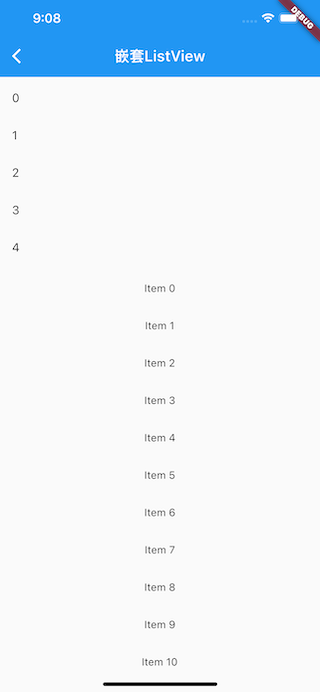
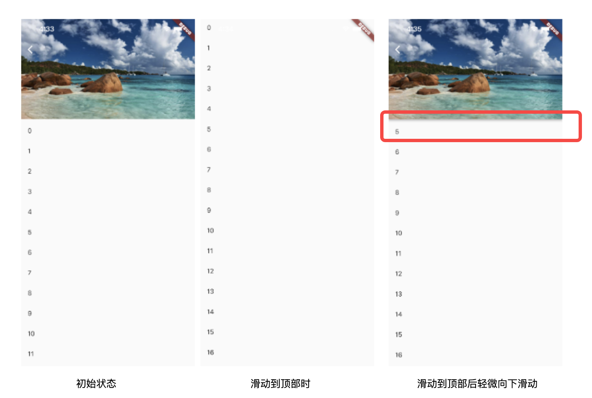

# 6.12 嵌套可滚动组件 NestedScrollView

## 6.12.1 NestedScrollView

上一节中，我们知道 CustomScrollView 只能组合 Sliver，如果有孩子也是一个可滚动组件（通过 SliverToBoxAdapter 嵌入）且它们的滑动方向一致时便不能正常工作。为了解决这个问题，Flutter 中提供了一个NestedScrollView 组件，它的功能时组合（协调）两个可滚动组件，下面我们看看它的定义：

```dart
const NestedScrollView({
  ... //省略可滚动组件的通用属性
  //header，sliver构造器
  required this.headerSliverBuilder,
  //可以接受任意的可滚动组件
  required this.body,
  this.floatHeaderSlivers = false,
}) 
```

我们先看一个简单的示例，需要实现的页面的最终效果如图6-32所示：



页面有三部分组成：

1. 最上面是一个 AppBar，实现导航，要能固定在顶端
2. AppBar 下面是一个 SliverList，可以有任意多个列表项，为了演示，我们指定5个列表项即可。
3. 最下面是一个 ListView。

预期的效果是 SliverList 和 下面的 ListView 的滑动能够统一（而不是在下面ListView 上滑动时只有ListView响应滑动），整个页面在垂直方向是一个整体。实现代码如下：

```dart
Material(
  child: NestedScrollView(
    headerSliverBuilder: (BuildContext context, bool innerBoxIsScrolled) {
      // 返回一个 Sliver 数组给外部可滚动组件。
      return <Widget>[
        SliverAppBar(
          title: const Text('嵌套ListView'),
          pinned: true, // 固定在顶部
          forceElevated: innerBoxIsScrolled,
        ),
        buildSliverList(5), //构建一个 sliverList
      ];
    },
    body: ListView.builder(
      padding: const EdgeInsets.all(8),
      physics: const ClampingScrollPhysics(), //重要
      itemCount: 30,
      itemBuilder: (BuildContext context, int index) {
        return SizedBox(
          height: 50,
          child: Center(child: Text('Item $index')),
        );
      },
    ),
  ),
);
```

NestedScrollView  在逻辑上将可滚动组件分为了 header 和 body 两部分，header 部分我们可以认为是**外部**可滚动组件（outer scroll view），可以认为这个可滚动组件就是 CustomScrollView ，所以它只能接收 Sliver，我们通过`headerSliverBuilder`  来构建一个 Sliver 列表给外部的可滚动组件；而 body 部分可以接收任意的可滚动组件，该可滚动组件称为**内部**可滚动组件 （inner scroll view）。

> Flutter 的源码注释中和文档中会有 outer 和 inner 两个概念，分别指代外部和内部可滚动组件。


## 6.12.2 NestedScrollView 原理

NestedScrollView 的结构图如图6-33所示：


有几点解释：

1. NestedScrollView 整体就是一个 CustomScrollView （实际上是 CustomScrollView 的一个子类）
2. header 和 body 都是 CustomScrollView 的子 Sliver ，注意，虽然 body 是一个 RenderBox，但是它会被包装为 Sliver 。
3. CustomScrollView 将其所有子 Sliver 在逻辑上分为 header 和 body 两部分：header 是前面部分、body 是后面部分。
4. 当 body 是一个可滚动组件时， 它和 CustomScrollView 分别有一个 Scrollable ，由于 body 在 CustomScrollView  的内部，所以称其为内部可滚动组件，称 CustomScrollView 为外部可滚动组件；同时 因为 header 部分是 Sliver，所以没有独立的 Scrollable，滑动时是受 CustomScrollView 的 Scrollable 控制，所以为了区分，可以称 header 为外部可滚动组件（Flutter 文档中是这么约定的）。
5. NestedScrollView 核心功能就是通过一个协调器来协调外部可滚动组件和内部可滚动组件的滚动，以使滑动效果连贯统一，协调器的实现原理就是分别给内外可滚动组件分别设置一个 controller，然后通过这两个controller 来协调控制它们的滚动。

综上，在使用 NestedScrollView  有两点需要注意：

1. 要确认内部的可滚动组件（body）的 `physics` 是否需要设置为 `ClampingScrollPhysics`。比如上面的示例运行在 iOS 中时，ListView 如果没有设置为 `ClampingScrollPhysics`，则用户快速滑动到顶部时，会执行一个弹性效果，此时 ListView 就会与 header 显得割裂（滑动效果不统一），所以需要设置。但是，如果 header 中只有一个 SliverAppBar 则不应该加，因为 SliverAppBar 是固定在顶部的，ListView 滑动到顶部时上面已经没有要继续往下滑动的元素了，所以此时出现弹性效果是符合预期的。
2. 内部的可滚动组件（body的）不能设置 `controller` 和 `primary`，这是因为 NestedScrollView 的协调器中已经指定了它的 controller，如果重新设定则协调器将会失效。

## 6.12.3 SliverAppBar

上一节中我们已经使用过 SliverAppBar，但是并没有仔细介绍，因为它最常见的使用场景是在作为 NestedScrollView 的 header， 所以我们在本节介绍。

SliverAppBar 是 AppBar 的Sliver 版，大多数参数都相同，但 SliverAppBar 会有一些特有的功能，下面是 SliverAppBar 特有的一些配置：

```dart
const SliverAppBar({
  this.collapsedHeight, // 收缩起来的高度
  this.expandedHeight,// 展开时的高度
  this.pinned = false, // 是否固定
  this.floating = false, //是否漂浮
  this.snap = false, // 当漂浮时，此参数才有效
  bool forceElevated //导航栏下面是否一直显示阴影
  ...
})
```

- SliverAppBar 在 NestedScrollView 中随着用户的滑动是可以收缩和展开的，因此我们需要分别指定收缩和展开时的高度。
- `pinned` 为` true` 时 SliverAppBar 会固定在 NestedScrollView 的顶部，行为 和 SliverPersistentHeader 的 `pinned`功能一致。
- floating 和 snap：floating 为 true 时，SliverAppBar 不会固定到顶部，当用户向上滑动到顶部时，SliverAppBar 也会滑出可视窗口。当用户反向滑动时，SliverAppBar 的 snap 为 true 时，此时无论 SliverAppBar 已经滑出屏幕多远，都会立即回到屏幕顶部；但如果 snap 为 false，则 SliverAppBar 只有当向下滑到边界时才会重新回到屏幕顶部。这一点和 SliverPersistentHeader 的 `floating` 相似，但不同的是  SliverPersistentHeader 没有 snap 参数，当它的 `floating` 为 true 时，效果是等同于 SliverAppBar 的floating 和 snap 同时为 true 时的效果。

我们可以看到 SliverAppBar 的一些参数和 SliverPersistentHeader 很像，这是因为 SliverAppBar 内部就包含了一个  SliverPersistentHeader 组件，用于实现顶部固定和漂浮效果。

下面我们看一个示例：

```dart
class SnapAppBar extends StatelessWidget {
  const SnapAppBar({Key? key}) : super(key: key);

  @override
  Widget build(BuildContext context) {
    return Scaffold(
      body: NestedScrollView(
        headerSliverBuilder: (BuildContext context, bool innerBoxIsScrolled) {
          return <Widget>[
            // 实现 snap 效果
            SliverAppBar(
              floating: true,
              snap: true,
              expandedHeight: 200,
              forceElevated: innerBoxIsScrolled,
              flexibleSpace: FlexibleSpaceBar(
                background: Image.asset(
                  "./imgs/sea.png",
                  fit: BoxFit.cover,
                ),
              ),
            ),
          ];
        },
        body: Builder(builder: (BuildContext context) {
          return CustomScrollView(
            slivers: <Widget>[
              buildSliverList(100)
            ],
          );
        }),
      ),
    );
  }
}
```

运行后效果如图6-34：



当我们滑动到顶部时，然后反向轻微滑动一点点，这时 SliverAppBar 就会整体回到屏幕顶部，但这时有一个问题，注意图中红色圈出来的部分，我们发现  SliverAppBar 返回到屏幕后将 0 - 4 这几个列表项遮住了！而按照正常的交互逻辑，预期是不能遮住的，因为往下滑时，用户就是为了看上面的内容，SliverAppBar 突然整体回到屏幕后正好遮住了上面的内容，这时，用户不得不继续往下再滑动一些距离，这个体验很不好。

为了解决这个问题，能立马想到的思路就是当 SliverAppBar 在回到屏幕的过程中，底下的列表项也同时往下滑相应的偏移就 OK 了。但是我们要动手时发现了问题，因为无论是想监听 header 的滑动信息和控制 body 的滑动都需要用到内外部可滚动组件的 controller ，而 controller 的持有者是 NestedScrollView 的协调器，我们很难获取取，就算能获取（通过context），那也是 NestedScrollView 的内部逻辑，我们不应在在外部去干涉，这样不符合职责分离模式，是有侵入性的 。 Flutter 的开发者也意识到了这点，于是提供了一个标准的解决方案，我们先看看如何解决，再解释，我们修改上面的代码：

```dart
class SnapAppBar extends StatelessWidget {
  const SnapAppBar({Key? key}) : super(key: key);

  @override
  Widget build(BuildContext context) {
    return Scaffold(
      body: NestedScrollView(
        headerSliverBuilder: (BuildContext context, bool innerBoxIsScrolled) {
          return <Widget>[
            SliverOverlapAbsorber(
              handle: NestedScrollView.sliverOverlapAbsorberHandleFor(context),
              sliver: SliverAppBar(
                floating: true,
                snap: true,
                expandedHeight: 200,
                flexibleSpace: FlexibleSpaceBar(
                  background: Image.asset(
                    "./imgs/sea.png",
                    fit: BoxFit.cover,
                  ),
                ),
                forceElevated: innerBoxIsScrolled,
              ),
            ),
          ];
        },
        body: Builder(builder: (BuildContext context) {
          return CustomScrollView(
            slivers: <Widget>[
              SliverOverlapInjector(
                handle: NestedScrollView.sliverOverlapAbsorberHandleFor(context),
              ),
              buildSliverList(100)
            ],
          );
        }),
      ),
    );
  }
}
```

上面代码运行后问题解决，笔者就不贴图了。需要注意的是和之前的代码相比有两个部分发生了变化：

1. SliverAppBar 用 SliverOverlapAbsorber 包裹了起来，它的作用就是获取 SliverAppBar 返回时遮住内部可滚动组件的部分的长度，这个长度就是 overlap（重叠） 的长度。
2. 在 body 中往 CustomScrollView 的 Sliver列表的最前面插入了一个 SliverOverlapInjector，它会将 SliverOverlapAbsorber 中获取的 overlap 长度应用到内部可滚动组件中。这样在 SliverAppBar 返回时内部可滚动组件也会相应的同步滑动相应的距离。

SliverOverlapAbsorber 和 SliverOverlapInjector 都接收有一个 handle，给它传入的是`NestedScrollView.sliverOverlapAbsorberHandleFor(context)` 。好家伙，名字一个比一个长！但不要被吓到， handle 就是 SliverOverlapAbsorber 和  SliverOverlapInjector 的通信桥梁，即传递 overlap 长度。

以上便是 NestedScrollView 提供的标准解决方案，可能直观上看起来不是很优雅，但笔者站在NestedScrollView 开发者的角度暂时也没有想到更好的方式。不过，幸运的是，这是一个标准方案，有需要直接复制代码即可。

实际上，当 snap 为 true 时，只需要给 SliverAppBar 包裹一个 SliverOverlapAbsorber即可，而无需再给 CustomScrollView 添加 SliverOverlapInjector，因为这种情况 SliverOverlapAbsorber 会自动吸收 overlap，以调整自身的布局高度为 SliverAppBar 的实际高度，这样的话 header 的高度变化后就会自动将 body 向下撑（header 和 body 属于同一个 CustomScrollView），同时，handle 中的 overlap 长度始终 0。**而只有当 SliverAppBar 别 SliverOverlapAbsorber 包裹且为固定模式时**（pinned 为 true ），CustomScrollView 中添加SliverOverlapInjector 才有意义， handle 中的 overlap 长度不为 0。我们可以通过以下代码验证：

```dart
class SnapAppBar2 extends StatefulWidget {
  const SnapAppBar2({Key? key}) : super(key: key);

  @override
  State<SnapAppBar2> createState() => _SnapAppBar2State();
}

class _SnapAppBar2State extends State<SnapAppBar2> {
  // 将handle 缓存
  late SliverOverlapAbsorberHandle handle;

  void onOverlapChanged(){
    // 打印 overlap length
    print(handle.layoutExtent);
  }

  @override
  Widget build(BuildContext context) {
    return Scaffold(
      body: NestedScrollView(
        headerSliverBuilder: (BuildContext context, bool innerBoxIsScrolled) {
          handle = NestedScrollView.sliverOverlapAbsorberHandleFor(context);
          //添加监听前先移除旧的
          handle.removeListener(onOverlapChanged);
          //overlap长度发生变化时打印
          handle.addListener(onOverlapChanged);
          return <Widget>[
            SliverOverlapAbsorber(
              handle: handle,
              sliver: SliverAppBar(
                floating: true,
                snap: true,
                // pinned: true,  // 放开注释，然后看日志
                expandedHeight: 200,
                flexibleSpace: FlexibleSpaceBar(
                  background: Image.asset(
                    "./imgs/sea.png",
                    fit: BoxFit.cover,
                  ),
                ),
                forceElevated: innerBoxIsScrolled,
              ),
            ),
          ];
        },
        body: LayoutBuilder(builder: (BuildContext context,cons) {
          return CustomScrollView(
            slivers: <Widget>[
              SliverOverlapInjector(handle: handle),
              buildSliverList(100)
            ],
          );
        }),
      ),
    );
  }

  @override
  void dispose() {
    // 移除监听器
    handle.removeListener(onOverlapChanged);
    super.dispose();
  }
}
```

我们可以分别查看 snap 模式下和 pinned 模式下控制台的输出即可验证。

综上，笔者还是建议 SliverOverlapAbsorber 和 SliverOverlapInjector 配对使用，这样可以避免我们日后将snap模式改为固定模式后忘记添加 SliverOverlapInjector 而导致bug。


## 6.12.4 嵌套 TabBarView

我们实现商城主页，它有三个Tab，为了获得更大的商品显示空间，我们希望用户向上滑动时 导航栏能够滑出屏幕，当用户向下滑动时，导航栏能迅速回到屏幕，因为向下滑动时可能是用户想看之前的商品，也可能是用户向找到导航栏返回。我们要实现的页面效果如下（初始状态）：

```dart
class NestedTabBarView1 extends StatelessWidget {
  const NestedTabBarView1({Key? key}) : super(key: key);

  @override
  Widget build(BuildContext context) {
    final _tabs = <String>['猜你喜欢', '今日特价', '发现更多'];
    // 构建 tabBar
    return DefaultTabController(
      length: _tabs.length, // This is the number of tabs.
      child: Scaffold(
        body: NestedScrollView(
          headerSliverBuilder: (BuildContext context, bool innerBoxIsScrolled) {
            return <Widget>[
              SliverOverlapAbsorber(
                handle: NestedScrollView.sliverOverlapAbsorberHandleFor(context),
                sliver: SliverAppBar(
                  title: const Text('商城'),
                  floating: true,
                  snap: true,
                  forceElevated: innerBoxIsScrolled,
                  bottom: TabBar(
                    tabs: _tabs.map((String name) => Tab(text: name)).toList(),
                  ),
                ),
              ),
            ];
          },
          body: TabBarView(
            children: _tabs.map((String name) {
              return Builder(
                builder: (BuildContext context) {
                  return CustomScrollView(
                    key: PageStorageKey<String>(name),
                    slivers: <Widget>[
                      SliverOverlapInjector(
                        handle: NestedScrollView.sliverOverlapAbsorberHandleFor(context),
                      ),
                      SliverPadding(
                        padding: const EdgeInsets.all(8.0),
                        sliver: buildSliverList(50),
                      ),
                    ],
                  );
                },
              );
            }).toList(),
          ),
        ),
      ),
    );
  }
}
```

