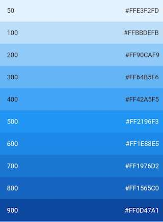
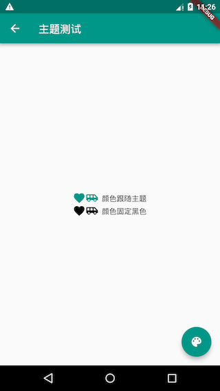

# 7.4 颜色和主题

## 7.4.1 颜色

在介绍主题前我们先了解一些Flutter中的 Color 类。Color 类中颜色以一个 int 值保存，我们知道显示器颜色是由红、绿、蓝三基色组成，每种颜色占8比特，存储结构如下：

| Bit（位） | 颜色             |
| --------- | ---------------- |
| 0-7       | 蓝色             |
| 8-15      | 绿色             |
| 16-23     | 红色             |
| 24-31     | Alpha (不透明度) |

上面表格中的的字段在 Color 类中都有对应的属性，而Color中的众多方法也就是操作这些属性的，由于大多比较简单，读者可以查看类定义了解。在此我们主要讨论两点：色值转换和亮度。

### **如何将颜色字符串转成 Color 对象**

如 Web 开发中的色值通常是一个字符串如"#dc380d"，它是一个 RGB 值，我们可以通过下面这些方法将其转为Color类：

```dart
Color(0xffdc380d); //如果颜色固定可以直接使用整数值
//颜色是一个字符串变量
var c = "dc380d";
Color(int.parse(c,radix:16)|0xFF000000) //通过位运算符将Alpha设置为FF
Color(int.parse(c,radix:16)).withAlpha(255)  //通过方法将Alpha设置为FF
```

### 颜色亮度

假如，我们要实现一个背景颜色和Title可以自定义的导航栏，并且背景色为深色时我们应该让Title显示为浅色；背景色为浅色时，Title 显示为深色。要实现这个功能，我们就需要来计算背景色的亮度，然后动态来确定Title的颜色。Color 类中提供了一个`computeLuminance()`方法，它可以返回一个[0-1]的一个值，数字越大颜色就越浅，我们可以根据它来动态确定Title的颜色，下面是导航栏NavBar的简单实现：

```dart
class NavBar extends StatelessWidget {
  final String title;
  final Color color; //背景颜色

  NavBar({
    Key? key,
    required this.color,
    required this.title,
  });

  @override
  Widget build(BuildContext context) {
    return Container(
      constraints: BoxConstraints(
        minHeight: 52,
        minWidth: double.infinity,
      ),
      decoration: BoxDecoration(
        color: color,
        boxShadow: [
          //阴影
          BoxShadow(
            color: Colors.black26,
            offset: Offset(0, 3),
            blurRadius: 3,
          ),
        ],
      ),
      child: Text(
        title,
        style: TextStyle(
          fontWeight: FontWeight.bold,
          //根据背景色亮度来确定Title颜色
          color: color.computeLuminance() < 0.5 ? Colors.white : Colors.black,
        ),
      ),
      alignment: Alignment.center,
    );
  }
}
```

测试代码如下：

```dart
Column(
  children: <Widget>[
    //背景为蓝色，则title自动为白色
    NavBar(color: Colors.blue, title: "标题"), 
    //背景为白色，则title自动为黑色
    NavBar(color: Colors.white, title: "标题"),
  ]
)
```

运行效果如图7-4所示：


### MaterialColor

`MaterialColor`是实现Material Design中的颜色的类，它包含一种颜色的10个级别的渐变色。`MaterialColor`通过"[]"运算符的索引值来代表颜色的深度，有效的索引有：50，100，200，…，900，数字越大，颜色越深。`MaterialColor`的默认值为索引等于500的颜色。举个例子，`Colors.blue`是预定义的一个`MaterialColor`类对象，定义如下：

```dart
static const MaterialColor blue = MaterialColor(
  _bluePrimaryValue,
  <int, Color>{
     50: Color(0xFFE3F2FD),
    100: Color(0xFFBBDEFB),
    200: Color(0xFF90CAF9),
    300: Color(0xFF64B5F6),
    400: Color(0xFF42A5F5),
    500: Color(_bluePrimaryValue),
    600: Color(0xFF1E88E5),
    700: Color(0xFF1976D2),
    800: Color(0xFF1565C0),
    900: Color(0xFF0D47A1),
  },
);
static const int _bluePrimaryValue = 0xFF2196F3;
```

我们可以根据 shadeXX 来获取具体索引的颜色。`Colors.blue.shade50`到`Colors.blue.shade900`的色值从浅蓝到深蓝渐变，效果如图7-5所示：




## 7.4.2 Theme

`Theme`组件可以为Material APP定义主题数据（ThemeData）。Material组件库里很多组件都使用了主题数据，如导航栏颜色、标题字体、Icon样式等。`Theme`内会使用`InheritedWidget`来为其子树共享样式数据。

### ThemeData

`ThemeData`用于保存是Material 组件库的主题数据，Material组件需要遵守相应的设计规范，而这些规范可自定义部分都定义在ThemeData中了，所以我们可以通过ThemeData来自定义应用主题。在子组件中，我们可以通过`Theme.of`方法来获取当前的`ThemeData`。

> 注意：Material Design 设计规范中有些是不能自定义的，如导航栏高度，ThemeData只包含了可自定义部分。

我们看看`ThemeData`部分数据定义：

```dart
ThemeData({
  Brightness? brightness, //深色还是浅色
  MaterialColor? primarySwatch, //主题颜色样本，见下面介绍
  Color? primaryColor, //主色，决定导航栏颜色
  Color? cardColor, //卡片颜色
  Color? dividerColor, //分割线颜色
  ButtonThemeData buttonTheme, //按钮主题
  Color dialogBackgroundColor,//对话框背景颜色
  String fontFamily, //文字字体
  TextTheme textTheme,// 字体主题，包括标题、body等文字样式
  IconThemeData iconTheme, // Icon的默认样式
  TargetPlatform platform, //指定平台，应用特定平台控件风格
  ColorScheme? colorScheme,
  ...
})
```

上面只是`ThemeData`的一小部分属性，完整的数据定义读者可以查看SDK。上面属性中需要说明的是`primarySwatch`，它是主题颜色的一个"样本色"，通过这个样本色可以在一些条件下生成一些其它的属性，例如，如果没有指定`primaryColor`，并且当前主题不是深色主题，那么`primaryColor`就会默认为`primarySwatch`指定的颜色，还有一些相似的属性如`indicatorColor`也会受`primarySwatch`影响。

### 示例

我们实现一个路由换肤功能：

```dart

class ThemeTestRoute extends StatefulWidget {
  @override
  _ThemeTestRouteState createState() => _ThemeTestRouteState();
}

class _ThemeTestRouteState extends State<ThemeTestRoute> {
  var _themeColor = Colors.teal; //当前路由主题色

  @override
  Widget build(BuildContext context) {
    ThemeData themeData = Theme.of(context);
    return Theme(
      data: ThemeData(
          primarySwatch: _themeColor, //用于导航栏、FloatingActionButton的背景色等
          iconTheme: IconThemeData(color: _themeColor) //用于Icon颜色
      ),
      child: Scaffold(
        appBar: AppBar(title: Text("主题测试")),
        body: Column(
          mainAxisAlignment: MainAxisAlignment.center,
          children: <Widget>[
            //第一行Icon使用主题中的iconTheme
            Row(
                mainAxisAlignment: MainAxisAlignment.center,
                children: <Widget>[
                  Icon(Icons.favorite),
                  Icon(Icons.airport_shuttle),
                  Text("  颜色跟随主题")
                ]
            ),
            //为第二行Icon自定义颜色（固定为黑色)
            Theme(
              data: themeData.copyWith(
                iconTheme: themeData.iconTheme.copyWith(
                    color: Colors.black
                ),
              ),
              child: Row(
                  mainAxisAlignment: MainAxisAlignment.center,
                  children: <Widget>[
                    Icon(Icons.favorite),
                    Icon(Icons.airport_shuttle),
                    Text("  颜色固定黑色")
                  ]
              ),
            ),
          ],
        ),
        floatingActionButton: FloatingActionButton(
            onPressed: () =>  //切换主题
                setState(() =>
                _themeColor =
                _themeColor == Colors.teal ? Colors.blue : Colors.teal
                ),
            child: Icon(Icons.palette)
        ),
      ),
    );
  }
}
```

运行后点击右下角悬浮按钮则可以切换主题，如图7-6、7-7所示：




需要注意的有三点：

- 可以通过局部主题覆盖全局主题，正如代码中通过 Theme 为第二行图标指定固定颜色（黑色）一样，这是一种常用的技巧，Flutter 中会经常使用这种方法来自定义子树主题。那么为什么局部主题可以覆盖全局主题？这主要是因为 widget 中使用主题样式时是通过`Theme.of(BuildContext context)`来获取的，我们看看其简化后的代码：

- ```dart 
  static ThemeData of(BuildContext context, { bool shadowThemeOnly = false }) {
     // 简化代码，并非源码  
     return context.dependOnInheritedWidgetOfExactType<_InheritedTheme>().theme.data
  }
  ```

  `context.dependOnInheritedWidgetOfExactType` 会在 widget 树中从当前位置向上查找第一个类型为`_InheritedTheme`的 widget。所以当局部指定`Theme`后，其子树中通过`Theme.of()`向上查找到的第一个`_InheritedTheme`便是我们指定的`Theme`。

- 本示例是对单个路由换肤，如果想要对整个应用换肤，则可以去修改`MaterialApp`的`theme`属性。
